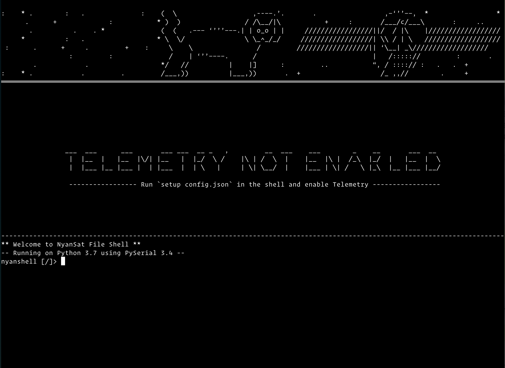
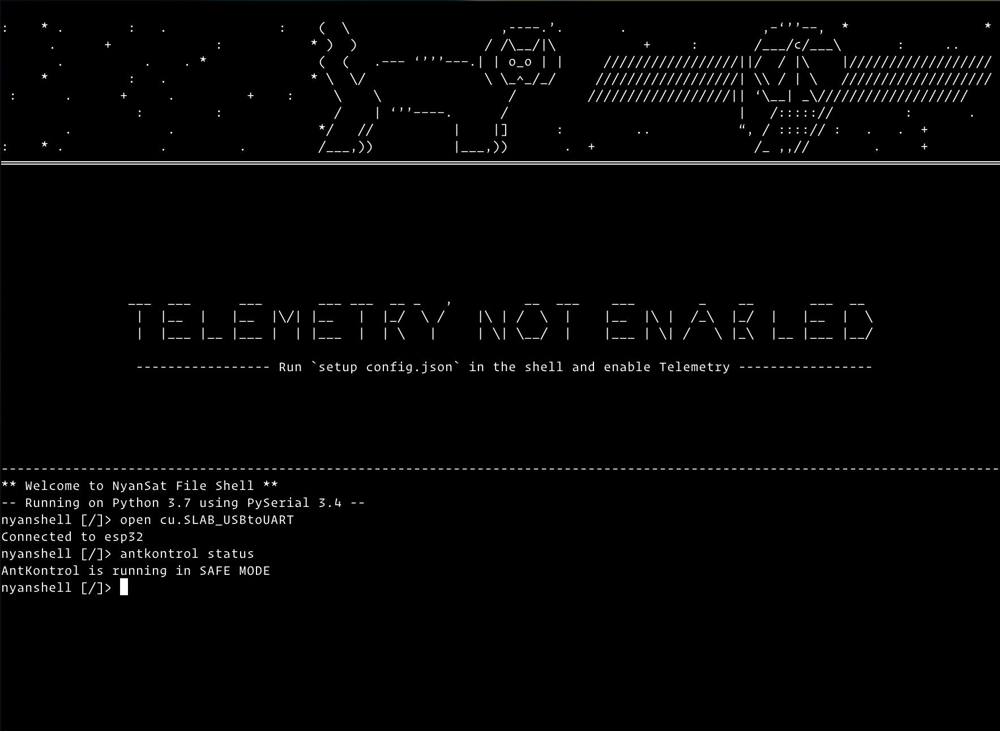

# NyanSat

Make your own base station to communicate with satellites!

## Setting Up

These set up procedures expect that your base station is fully assembled and your ESP32 is flashed with Micropython firmware. If not, check the NyanSat website for detailed steps on how to assemble your hardware, plus some tips on avoiding common pitfalls.

### Set up your host environment

NyanShell provides a convenient shell interface to communicate with your NyanSat base station. To install this interface, simply type `make nyanshell` in the project directory.

### Set up your base station environment

Once your host is set up, you can install NyanSat on your ESP32. Before anything, make sure you have a fully erased, freshly flashed micropython installation on your ESP32.

 First, determine which serial port corresponds to your ESP32. Then from the project directory, run `make nyansat SERIAL=<your ESP32 serial port>` to install it on your ESP32. During this process, you will be asked for your WiFi SSID and Password; this is to establish an internet connection for upip, which will install some dependencies. Towards the end of the install process, the script will ask you to setup webrepl on the ESP32.

## Usage

To enter NyanShell, type the following in a terminal window:

```
python3 -m nyansat.host
```

You should be greeted with a terminal window that looks like this:



The device is not connected automatically. You have several options to connect to the device; type the commands listed under your preferred connection option

### Connecting Via Serial

```
open <your ESP32's serial port>
```

### Connecting Via WebREPL

```
open ws:<your ESP32's IP address>,<your webrepl password>
```

### Exploring the Shell

Once you have connected to your ESP32, we still need to configure it to properly use NyanSat. However, this is a good opportunity to check out all of the available commands at your disposal! Type `help` to get the list.

To get more information about each documented command, you can type `help <command>` to get a brief description of the command including how to use it.

### Configuring AntKontrol

The heart of NyanSat is AntKontrol, a scalable API that you can extend to add more features on your NyanSat device. An AntKontrol instance is usually started up when the ESP32 boots up. However, if you wish to create a new instance, you can run `antkontrol start`. 

AntKontrol attempts to integrate different hardware into one interface. It is usually able to recover from misbehaving hardware and provide reduced functionality. However, if the motor implementation does not initialize properly, AntKontrol enters SAFE MODE. In this state, any commands issued will not move your base station's motors until you determine what the fault is. To determine if your device is in SAFE MODE, run `antkontrol status`. 



One of the main reasons why AntKontrol would enter SAFE MODE is an incorrect configuration. Depending on your setup, you may have a different pin layout, device addresses, or hardware than what NyanSat is expecting. Accordingly, you can use the `setup`, `i2ctest`, `pwmtest`, and `bnotest` commands to resolve the first two issues. For different hardware, the `repl` command provides you with a full Python interpreter, which you can use to implement your own exciting hardware. *Note:* If you wish to use the `repl` command, start nyanshell with the command `python3 -m nyansat.host.shell`; this command removes all decorative and telemetry elements, proviving a focused environment for debugging.

By default, several features are disabled for the initial setup; this is to reduce debugging complexity. As you get familiar with the shell and hardware, you can choose to enable them using the `configs` and `set` commands to query and modify your configuration respectively.

## Features

### Easy Pin Setup and Profile Management

If your pin configuration is different from the default values, you can easily change to them by running the `setup <profile_name>` command. This command creates a new profile with your given name and switches to it.

If you have multiple pin configurations on the ESP32, you can switch between them using the `switch <profile_name>` command. This command switches to your chosen profile, leaving the original one intact, but not in use.

### Telemetry

The NyanShell interface puts key metrics front and center from your base station. The interface displays the azimuth, elevation, and (if equipped with GPS module) your ground coordinates.

### IMU Calibration Guide (BNO055 specific)

Calibrating IMU's are difficult; the BNO055 is especially tough. NyanShell provides a calibration command to easily poll the calibration status of your BNO055. If the IMU is not calibrated, the command guides you through the process with on screen instructions and real time feedback on the calibration status. To start, simply type `calibrate` into the shell and follow the instructions until your IMU is calibrated.

If you have a predefined configuration with an IMU calibration profile, you can use the profile management commands to load the IMU calibration values.

### Motor Accuracy Measurement

While servo motors can take a position as input and try to reach it, the motor will not _exactly_ reach that position. Using the IMU, the `motortest` command cross references the position change of the motor with the measured change from the IMU. This allows you to see how accurately the motor assumes the desired position.

## Requirements & Dependencies

General:
- Python >= 3.6

NyanShell:
- MPFShell
- TUI-DOM

NyanSat:
- Logging
- PCA9685 Adafruit Library
- BNO055 Adafruit Library, adapted for use in Micropython by Peter Hinch
- SSD1306
